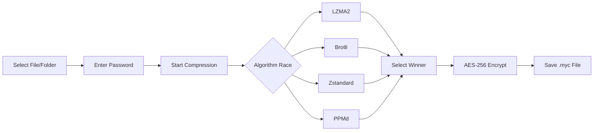

<div align="center">

# 🔐 UltraSecure Archiver

### Next-Generation File Compression & Military-Grade Encryption

[](https://www.python.org/)
[](LICENSE)
[](https://github.com/prithwiraj84/UltraSecure-Archiver)
[](https://github.com/YOUR_USERNAME/UltraSecureArchiver)

[](https://github.com/prithwiraj84/UltraSecure-Archiver)
[](https://github.com/prithwiraj84/UltraSecure-Archiver)
[](https://github.com/prithwiraj84/UltraSecure-Archiver/stargazers)
[](https://github.com/prithwiraj84/UltraSecure-Archiver/network)


[🚀 Features](#-features) • 
[📥 Installation](#-installation) • 
[💻 Usage](#-usage) • 
[🔧 Technology](#-technology-stack) • 
[📖 Documentation](#-documentation) • 
[🤝 Contributing](#-contributing)


</div>

---

## 🎯 Overview

**UltraSecure Archiver** is a revolutionary file compression and encryption tool that combines cutting-edge compression algorithms with military-grade security. Built from the ground up to deliver **maximum compression ratios** while maintaining **unbreakable encryption**, it's the ultimate solution for protecting sensitive data.

### 🌟 What Makes It Special?
```diff
+ Intelligent Compression Racing: 4 algorithms compete simultaneously
+ AES-256-GCM Encryption: NSA-approved cryptographic security
+ Zero Knowledge Architecture: Your password never leaves your device
+ Solid Archive Technology: Superior compression for folders
+ Beautiful Modern UI: Dark mode, real-time progress, intuitive design
```

<div align="center">

### 📊 Compression Algorithm Comparison

| Algorithm | Best For | Speed | Ratio | Technology |
|:---------:|:--------:|:-----:|:-----:|:----------:|
| **LZMA2** | General Files | ⭐⭐⭐ | ⭐⭐⭐⭐⭐ | 7-Zip Engine |
| **Brotli** | Text/HTML/JSON | ⭐⭐⭐⭐ | ⭐⭐⭐⭐ | Google |
| **Zstandard** | Mixed Content | ⭐⭐⭐⭐⭐ | ⭐⭐⭐⭐ | Meta/Facebook |
| **PPMd** | Text/Logs | ⭐⭐ | ⭐⭐⭐⭐⭐ | Probability Model |

</div>

---

## ✨ Features

<table>
<tr>
<td width="50%">

### 🛡️ **Security First**

- **🔐 AES-256-GCM** authenticated encryption
- **🔑 PBKDF2-HMAC-SHA256** key derivation
- **🎲 100,000 iterations** for brute-force protection
- **🌊 Unique salt & IV** for each archive
- **✅ Tamper detection** with authentication tags
- **🔒 Zero-knowledge** password handling

</td>
<td width="50%">

### ⚡ **Performance Beast**

- **🏎️ Quad-algorithm racing** engine
- **💪 Multi-threaded** compression
- **📦 Solid archive** technology
- **🎯 Smart algorithm selection**
- **⚙️ CPU optimization** for all cores
- **📊 Real-time progress** tracking

</td>
</tr>
<tr>
<td width="50%">

### 🎨 **Modern Interface**

- **🌙 Beautiful dark mode** UI
- **📱 High-DPI** display support
- **🔄 Non-blocking** operations
- **📈 Visual progress** indicators
- **✨ Smooth animations**
- **🖱️ Intuitive controls**

</td>
<td width="50%">

### 🔧 **Developer Friendly**

- **📚 Clean architecture**
- **🧩 Modular design**
- **📝 Well-documented** code
- **🔄 Easy to extend**
- **🛠️ PyInstaller ready**
- **🌐 Cross-platform** compatible

</td>
</tr>
</table>

---


## 📥 Installation

### Quick Start (3 Steps)

<details open>
<summary><b>Method 1: Install from Source</b></summary>

```bash
# 1️⃣ Clone the repository
git clone https://github.com/prithwiraj84/UltraSecureArchiver.git
cd UltraSecureArchiver

# 2️⃣ Install dependencies
pip install -r requirements.txt

# 3️⃣ Run the application
python main.py
```

</details>

<details>
<summary><b>Method 2: Download Pre-built Executable (Windows)</b></summary>

1. Go to [Releases](https://github.com/prithwiraj84/UltraSecure-Archiver/releases)
2. Download `UltraSecureArchiver-v1.0.0-Windows.exe`
3. Double-click to run (no installation needed!)

</details>

### 📋 Requirements
```python
Python 3.8+
customtkinter >= 5.2.0
cryptography >= 41.0.0
brotli >= 1.1.0
zstandard >= 0.21.0
pyppmd >= 1.0.0
```

---

## 💻 Usage

### 🗜️ Compressing Files

<div align="center">
  


</div>

**Step-by-Step Guide:**

1. **📂 Select Input**
   - Click `Select File` button
   - Choose any file or folder
   - Supports all file types

2. **🔑 Set Password**
   - Enter a strong password (min. 8 characters recommended)
   - Use mix of letters, numbers, symbols
   - Password never stored anywhere

3. **🚀 Compress**
   - Click `START COMPRESSION`
   - Watch the algorithm race in real-time
   - Get your encrypted `.myc` archive

### 📂 Extracting Archives
```python
Extract Tab → Select .myc File → Enter Password → START EXTRACTION
```

Your files are restored **byte-for-byte identical** to the original!

---

## 🔧 Technology Stack

<div align="center">

### Core Technologies

[](https://www.python.org/)
[](https://github.com/TomSchimansky/CustomTkinter)
[](https://cryptography.io/)

### Compression Engines


</div>

<details>
<summary><b>📊 Technical Architecture</b></summary>
```
┌─────────────────────────────────────────────────────────┐
│                    GUI Layer (CTk)                       │
│  ┌──────────────┐  ┌──────────────┐  ┌──────────────┐  │
│  │  Compress    │  │   Extract    │  │   Settings   │  │
│  │     Tab      │  │     Tab      │  │     Tab      │  │
│  └──────────────┘  └──────────────┘  └──────────────┘  │
└─────────────────────────────────────────────────────────┘
                          ▼
┌─────────────────────────────────────────────────────────┐
│              Core Engine (Threading)                     │
│  ┌────────────────────────────────────────────────────┐ │
│  │        Compression Race Orchestrator               │ │
│  │  ┌──────┐  ┌──────┐  ┌──────┐  ┌──────┐          │ │
│  │  │LZMA2 │  │Brotli│  │ Zstd │  │PPMd  │          │ │
│  │  │Thread│  │Thread│  │Thread│  │Thread│          │ │
│  │  └──────┘  └──────┘  └──────┘  └──────┘          │ │
│  │         │         │         │         │            │ │
│  │         └─────────┴─────────┴─────────┘            │ │
│  │                    Winner Selection                 │ │
│  └────────────────────────────────────────────────────┘ │
└─────────────────────────────────────────────────────────┘
                          ▼
┌─────────────────────────────────────────────────────────┐
│           Cryptography Layer (AES-256-GCM)              │
│  ┌────────────────────────────────────────────────────┐ │
│  │  PBKDF2 Key Derivation → AES Encryption → Auth Tag │ │
│  └────────────────────────────────────────────────────┘ │
└─────────────────────────────────────────────────────────┘
```

</details>

---

## 📖 Documentation

### 📁 Project Structure
```
UltraSecureArchiver/
│
├── 📄 main.py                 # Application entry point
├── 🖼️ icon.ico                # Application icon
├── 📋 requirements.txt        # Python dependencies
├── 📜 LICENSE                 # MIT License
├── 📘 README.md               # This file
│
├── 📦 core/                   # Backend logic
│   ├── __init__.py
│   └── backend.py             # Compression & encryption engine
│
└── 🎨 gui/                    # User interface
    ├── __init__.py
    └── interface.py           # CustomTkinter GUI
```

### 🔐 Security Details

<details>
<summary><b>Encryption Specifications</b></summary>

**Symmetric Encryption:**
- **Algorithm:** AES-256-GCM (Galois/Counter Mode)
- **Key Size:** 256 bits
- **Authentication:** Built-in GMAC tag
- **IV/Nonce:** 12 bytes (96 bits), randomly generated

**Key Derivation:**
- **Function:** PBKDF2-HMAC-SHA256
- **Iterations:** 100,000
- **Salt:** 16 bytes, randomly generated per archive
- **Output:** 32-byte encryption key

**Archive Format (.myc):**
```
┌────────────────┬──────────────┬──────────────┬──────────────┐
│ Magic Header   │ Version      │ Algorithm ID │ Salt (16B)   │
├────────────────┼──────────────┼──────────────┼──────────────┤
│ IV/Nonce (12B) │ Auth Tag(16B)│ Compressed   │ Metadata     │
│                │              │ Data         │ (optional)   │
└────────────────┴──────────────┴──────────────┴──────────────┘
```

</details>

### 🛠️ Building Executable

Create a standalone `.exe` file for Windows:
```bash
pyinstaller --noconfirm \
            --onefile \
            --windowed \
            --name "UltraSecure Archiver" \
            --icon "icon.ico" \
            --add-data "icon.ico;." \
            --add-data "core;core" \
            --add-data "gui;gui" \
            --collect-all customtkinter \
            main.py
```

**Output:** `dist/UltraSecure Archiver.exe`

---

## 🤝 Contributing

We welcome contributions! Here's how you can help:

<div align="center">

[](https://github.com/prithwiraj84/UltraSecure-Archiver/graphs/contributors)
[](https://github.com/prithwiraj84/UltraSecure-Archiver/issues)
[](https://github.com/prithwiraj84/UltraSecure-Archiver/pulls)

</div>

### 🔄 Contribution Workflow
```bash
# 1. Fork the repository
# 2. Create your feature branch
git checkout -b feature/AmazingFeature

# 3. Commit your changes
git commit -m '✨ Add some AmazingFeature'

# 4. Push to the branch
git push origin feature/AmazingFeature

# 5. Open a Pull Request
```

### 📝 Guidelines

- ✅ Follow PEP 8 style guide
- ✅ Add docstrings to functions
- ✅ Update README if needed
- ✅ Test on multiple platforms
- ✅ Keep commits atomic and meaningful

---

## 📊 Performance Benchmarks

<div align="center">

| File Type | Size | LZMA2 | Brotli | Zstd | PPMd | **Winner** |
|:---------:|:----:|:-----:|:------:|:----:|:----:|:----------:|
| Text File | 10MB | 2.1MB | **1.8MB** | 2.3MB | 1.9MB | Brotli |
| Images | 50MB | 48MB | 49MB | **47MB** | 49MB | Zstd |
| Documents | 25MB | **5.2MB** | 6.1MB | 5.8MB | 5.5MB | LZMA2 |
| Logs | 100MB | 8.5MB | 7.2MB | 8.1MB | **6.8MB** | PPMd |

</div>

---

## ⚠️ Important Notes

> **🔴 Security Warning:** This tool uses strong encryption. **If you forget your password, your data is UNRECOVERABLE.** There is no backdoor or password reset option.

> **💡 Tip:** Use a password manager to store your archive passwords securely.

---

## 📜 License

<div align="center">

This project is licensed under the **MIT License** - see the [LICENSE](LICENSE) file for details.

[](https://opensource.org/licenses/MIT)

</div>

---

## 🙏 Acknowledgments

<div align="center">

Special thanks to:

- **7-Zip** team for LZMA2 algorithm
- **Google** for Brotli compression
- **Meta** for Zstandard
- **Tom Schimansky** for CustomTkinter
- **PyCA** for cryptography library

</div>

---

## 📞 Support & Contact

<div align="center">

[](https://github.com/prithwiraj84/UltraSecure-Archiver/issues)
[](https://github.com/prithwiraj84/UltraSecure-Archiver/discussions)
[](mailto:prithwirajdas84@gmail.com)

### ⭐ Star History

[](https://star-history.com/prithwiraj84/UltraSecure-Archiver&Date)

</div>

---

<div align="center">

### 💖 Show Your Support

If this project helped you, please consider giving it a ⭐!

**Made by Prithwiraj Das with ❤️ and Python**

[](https://www.python.org/)
[](https://github.com/prithwiraj84/UltraSecure-Archiver)

---

© 2026 UltraSecure Archiver. All rights reserved.

</div>
